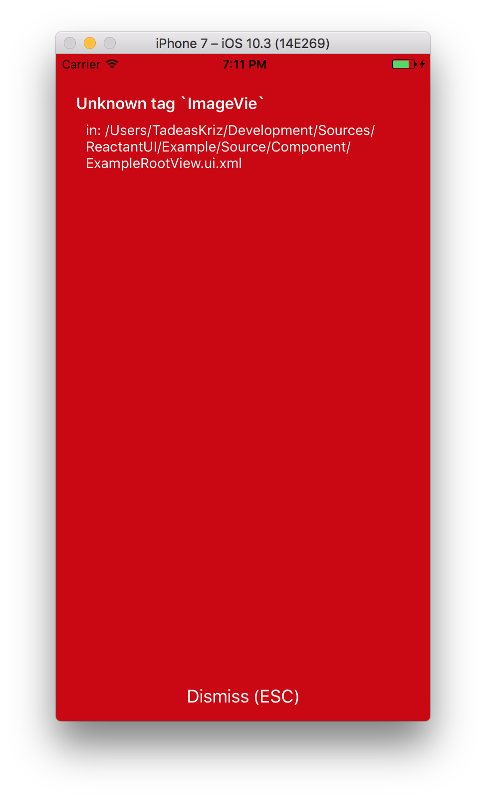
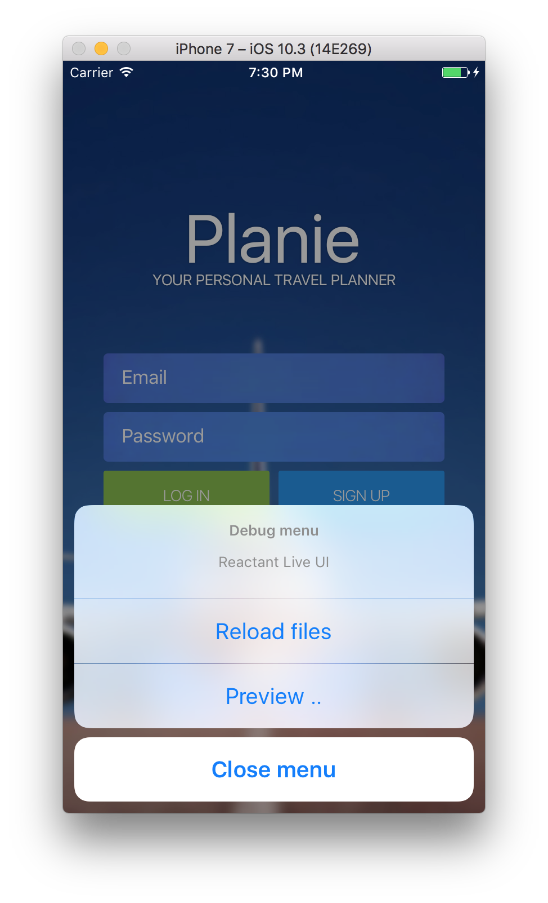
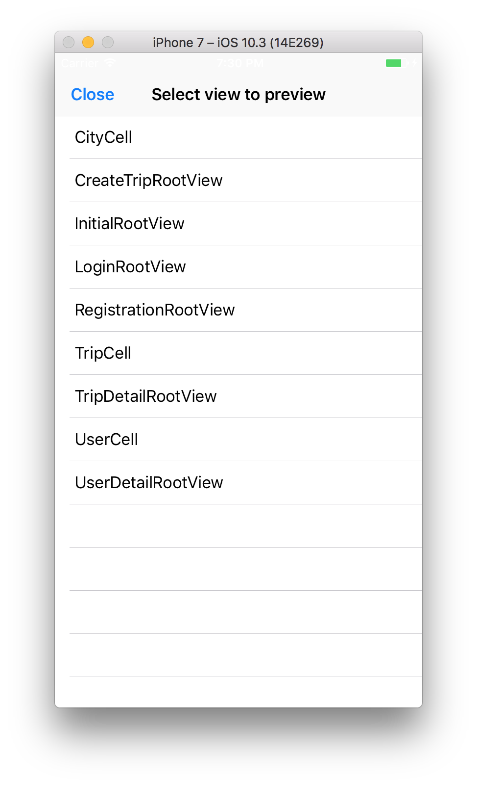

# Live Reload

Live Reload is an optional part of Reactant UI. Thanks to it, you don't need to recompile the whole application and find the screen you've been changing to test it. It will almost magically show new changes right after you save them. Take a look at the following video, where we build a simple login screen.

<iframe width="768" height="432" src="https://www.youtube.com/embed/iZ3lA7Lyd3E" frameborder="0" allowfullscreen></iframe>

## Installation
To enable Live Reload capabilities, you have to add the following dependency to your `Podfile` into your application's target.

```ruby
pod 'ReactantLiveUI', :configuration => 'Debug'
```

Notice the `:configuration => 'Debug'`. This means that the `ReactantLiveUI` will be linked only to your `Debug` build configuration. This is important to not carry this code into your release build.

Afterwards, run `pod install` to install it, then open your project and locate the `Generate Reactant UI` build phase we set up in the [Reactant UI introduction](./introduction.md). On the last line, where you run the `reactant-ui` command, add a parameter `--enable-live`. The line should look similar to the following one:

```sh
"$PODS_ROOT/ReactantUI/.build/debug/reactant-ui" --enable-live > "$SRCROOT/Application/Generated/GeneratedUI.swift"
```

Last step, open your `AppDelegate.swift` and in `application(_:didFinishLaunchingWithOptions:)` method add line:

```swift
activateLiveReload(in: window)
```

This `activateLiveReload(in:)` method gets generated by the `reactant-ui` command and you need to give it an instance of your key `UIWindow`. If you followed our [architecture guide](../getting-started/architecture.md), you should have access to it in the `AppDelegate.swift`.

## Usage

After the installation, you can build and run your application on iOS Simulator and edit your XML files containing the UI. You'll see it reload instantaneously after saving.

**NOTE**: Support for Live Reload is currently limited to iOS Simulator. We plan to add support for running on iOS devices in the near future.

### Error screen

If you change your UI XML file in a way that's not compatible with Reactant UI, you'll see a red error screen to know what's wrong.



### Debug menu
ReactantLiveUI also comes with a debug menu. At this moment it allows preview and reloading all XML UI files. To open it, press `Cmd+D` shortcut.



### Preview
ReactantLiveUI allows you to show a list of all view components in your codebase that use Reactant UI and let you preview each one of them.



In this list you can select a specific view component and have it displayed. This will allow you to preview parts of your application without the need to go through the whole application to find it.

### Reload files
When you create new `.ui.xml` file, ReactantLiveUI doesn't know about it until you either build and run the app again, or run the `Reload files` through the Debug menu.
